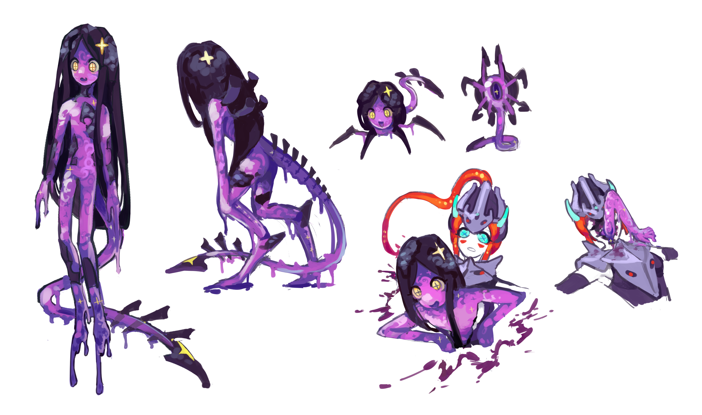

# Heaven's Hell Sent Gifts

我被大画家值班，就像被狗吃掉的星虫...

大病一场

## Astrum Deus

> 星神浪竜/ 星《アストラム》の神《デウス》

空心炸鳞可怜虫。疯疯癫癫的，却还保留着一丝神性。

本来是吃掉死星来清理星辉瘟疫的星神一条，被神吞（方法未知）偷袭吃掉，下半身和内部都被掏空了。

现在和瘟疫共存...长回了下半身，但是内部被一层瘟疫组织接管，长不回来了。脊柱在空洞的胸腔里肿胀成类似心脏的形状，借此看起来稍微充实点。

~~本来清理瘟疫的神在狗的压力下终究还是跟最讨厌的瘟疫签订了契约~~
 

其实只是星神的残余部分变成的，保留了它的记忆而已。

上臂炸鳞的部分参考毛领，四肢逐渐被鳞片和瘟疫覆盖的地方参考肢端坏死和紫绀。
异化的脚设计参考异形女王的爪子

造型设计参考古欧洲肺结核贵妇。

被瘟疫感染到脑子，每次想恢复都会同时想散播瘟疫，感染全世界。

很渴望一颗心，但是往体内塞进的东西最终都变成了瘟疫的，吃进去的东西也一样。

头尾是弱点，会把尾巴藏起来，只有资深信徒（已经不存在）才能看

✝天罚☦「神火」

~~圣水~~

> 只知道冷淡的高高在上的呼风唤雨的遥远的大画家，小时候根植在心里的形象。虽然大画家凑近了，发现他和我们一样，也是人，但是凑近不了，那就是神。
>
> 星神掉下来了，不再是天上的明星了
>
> 跌落神坛了，教徒自然都散了，还有星病生人勿近

> 当然拜自己的欲望。古时求神拜佛求风调雨顺，本质上求得就是一种欲望，如果我无欲无求，那我就是神了，何必拜你？如果不能完成凡民的愿望，你凭何称为神，中国人不拜伪神。

> 当然赏自己的欲望。古时赏画，本质上赏得就是一种欲望，如果我无欲无求，那我何必赏你？如果不能完成观众爱看的画，你凭何称为画家，中国人不拜伪画家。
 
~~星病指代的是我的恶名，对吧~~

### [Invoked Star God](..\Primordials\README.md)

## Astrum Aureus
> 白金の星の宇宙船

被感染的嘉登械。现在处于赛博格的状态，长出了奇怪的血肉。

每个法师都需要它的细胞/电池，所以经常会被星神残忍地卸掉四肢，倒出电池去卖钱。

依赖体内的末世星史莱姆行动，史莱姆跑掉就会立刻陷入短路。

## Astrageldon Slime
> 終末の星のスライム

一个被忘掉的东西。

不算是真正的史莱姆。模式星之于史莱姆，就像异形之于人类。

算是星辉地最老的那一辈了，星神还健在时，就长在它的身体里了。

~~疑似是骨折码派来安排在星神体内的卧底~~

喜欢藏在别人的体内，从星神的身体里被赶出来后，就住在星虫的天堂，星舰来后，就藏在星舰体内。

史莱姆的身躯可以轻松藏进白金星舰的体内，也可以从任何一个洞安全地出来，但是它个人比较偏爱暴力破出。

想当星神，但是看见现任星神悲惨且残破的样子，不想去损害它的最后一点尊严，也就只会在它不在的时候接替这个职位了。

希望世界毁灭，希望末日来临。

希望这个世界被毁掉，然后带来新的世界。

### Otherworld
> 

来自平行世界的superboss模式星，亲手毁灭了平行世界。

平行世界的星虫战胜了狗，狗的尸体又传播了一种新型史莱姆星辉瘟疫。

图龙者终成恶龙。

模式星厌倦了这种你吃掉我，我吃掉你的世界，便决定自己上把所有东西都吃掉。

于是它做到了，然后毁灭过后，并没有新生。

# EN
An hollow worm with pinecone scales caused by Astral Infection. Looks ill, but still retains a hint of divinity.

It used to be the Star God, consuming these stars before the Astral Infection manifests in them, and it has been revered for its sacred duty since time immemorial.

Thus, it got killed by the Devourer of Gods, lower half and all innards was eaten.

Now, it's co-existing with the disease, have lower body grown back, but the innards got replaced by the infection. Its spine bloats like a heart, in the chest cavity opened by a incurable wound, makes it look a little more substantial.

~~The god who originally cleaned up the infection finally signed a contract with the most annoying infection under the pressure of DoG.~~

Wished a heart, but everything goes inside it will be consumed by the infection, including things it ate.

Still, it will put everything which looked like a heart into its chest cavity.