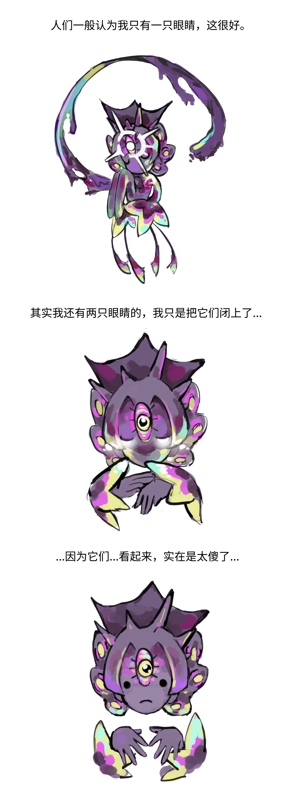

## Invoked Star God
> 呼び出された星の神

据说看见就会带来好运，人们也常常向它许愿。

## Ὕπνος

~~疑似是上一个穿越到泰安世界的人~~

邪神，被嘉登不知用何种手段杀死，大脑被清除记忆后做成了[XP-00 Hypnos](..\Exos\README.md)

别的神经被做成了捕梦网，悬挂在嘉登的床前...

在捕梦网旁边入睡，可以看见过去的事情，也可以得到启迪。

但是邪神（捕梦网的那部分）渴望复仇。

用启迪勾起嘉登的兴趣后，（造出巨械后不久）发起了致命一击，夺走了嘉登的爱魄。

从此，嘉登就成了那个衣冠禽兽。

## Goozma
> クーズマ

真·史莱姆之神。平时只有一个灵魂藏匿在雕像附近，有重大事件时，才会融合所有史莱姆并现身。（像基格尔德那样）

有一双很傻的眼睛。

## Ὕπνος

~~Suspected to be the last person who traveled to the world of Terraria~~

The evil god was killed by Draedon using unknown means, and its brain was cleared of memory and made into XP-00 Hypnos

Other nerves were made into dream catchers and hung in front of Draedon's bed...

Falling asleep next to a dream catcher can help you see past events and gain enlightenment.

But the evil god desires revenge.

After using enlightenment to arouse Draedon's interest, it launched a fatal blow and took away Draedon's soul of love.

From then on, Draedon became the mad scientist, the beast in disguise.