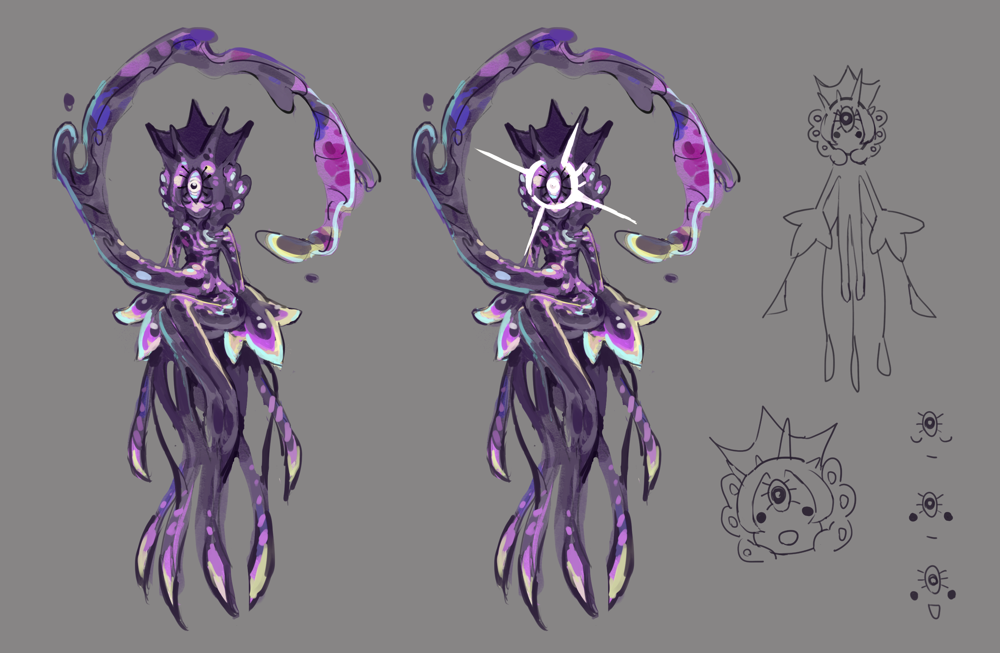

## Primordial Star God
> 呼び出された星の神

> "stars" / "future"

据说看见就会带来好运，人们也常常向它许愿。

已被神明吞噬者肢解。它的残骸变成了[星神游龙](..\Primordials\README.md)。，

## Ὕπνος
> "sleep" / "past"

~~疑似是上一个穿越到泰安世界的人~~

邪神，被嘉登不知用何种手段杀死，大脑被清除记忆后做成了[XP-00 Hypnos](..\Exos\README.md)

别的神经被做成了捕梦网，悬挂在嘉登的床前...

在捕梦网旁边入睡，可以看见过去的事情，也可以得到启迪。

但是邪神（捕梦网的那部分）渴望复仇。

用启迪勾起嘉登的兴趣后，（造出巨械后不久）发起了致命一击，夺走了嘉登的爱魄。

从此，嘉登就成了那个衣冠禽兽。

## Goozma
> クーズマ

> "slimes" / "chroma"

真·史莱姆之神。平时以一种以太的状态平均地分布在世界的每一个角落，有重大事件时，才会融合所有史莱姆并现身。（像基格尔德那样）
 
因为太老了没有学明白现代语言，只会讲老的（文言文 / 莎士比亚英文），再掺杂一些现代的

第三只眼才是本体。

视末世星为异种（蛮夷！），非常鄙视它