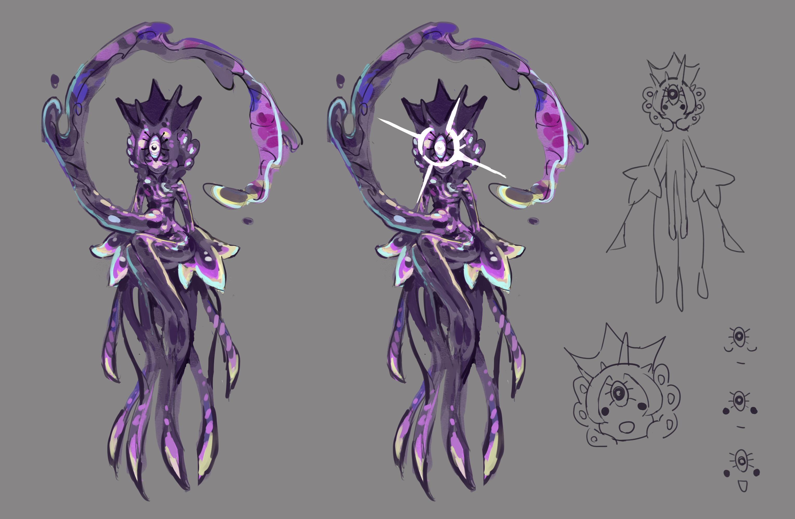

## Invoked Star God
> 呼び出された星の神

It's said that seeing it will bring good luck, and people often make wishes to it.

## Ὕπνος

~~Suspected to be the past real life human who traveled into the world of Terraria~~

The evil god was killed by Draedon using unknown means, and its brain was cleared of memory and made into [XP-00 Hypnos](..\Exos\README.md)

Other nerves were made into dream catchers and hung in front of Draedon's bed...

Falling asleep next to a dream catcher can help you see past events and gain enlightenment.

But the evil god (dream catcher part) desires revenge.

After using enlightenment to arouse Draedon's interest, (and after Draedon built the humanine exo mechs) it launched a fatal blow and took away Draedon's soul of love.

From then on, Draedon became the mad scientist, the beast in disguise.

## Goozma
> クーズマ

The true slime god. Usually it has only one soul hiding near the statue. When there is a major event, it will merge with all the slimes and appear. (like Zygarde)

It got a pair of silly eyes.

